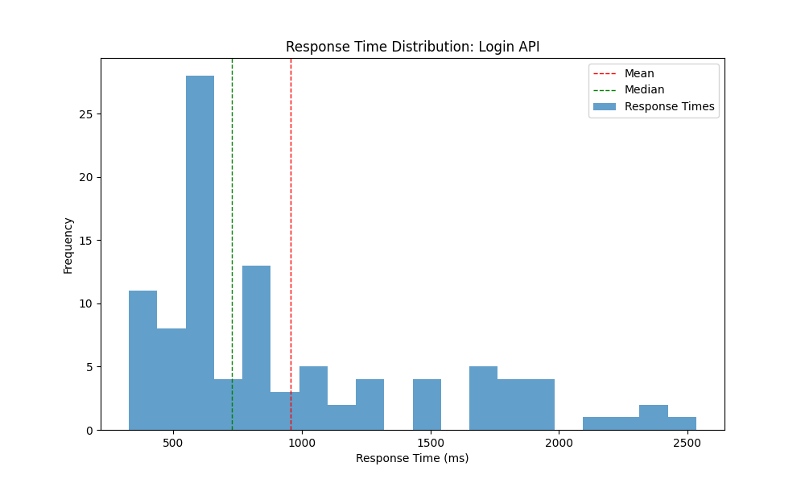
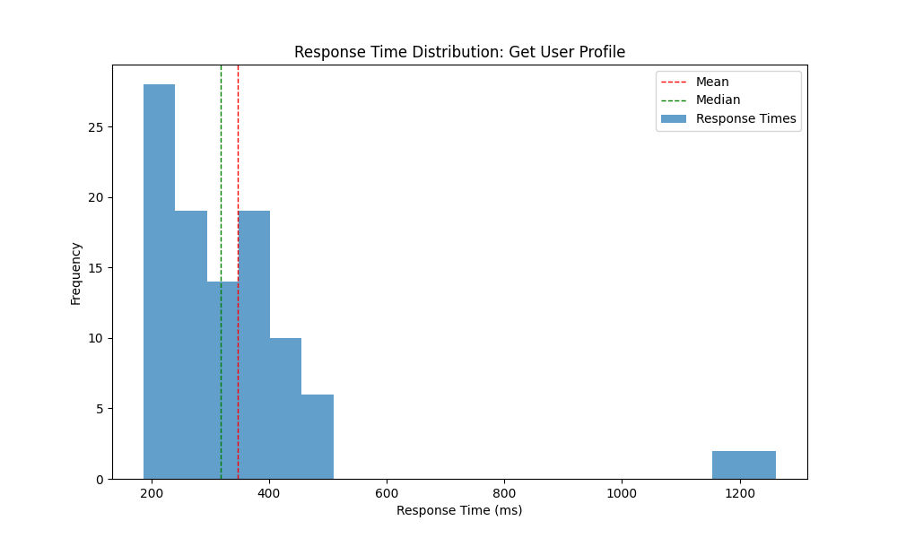
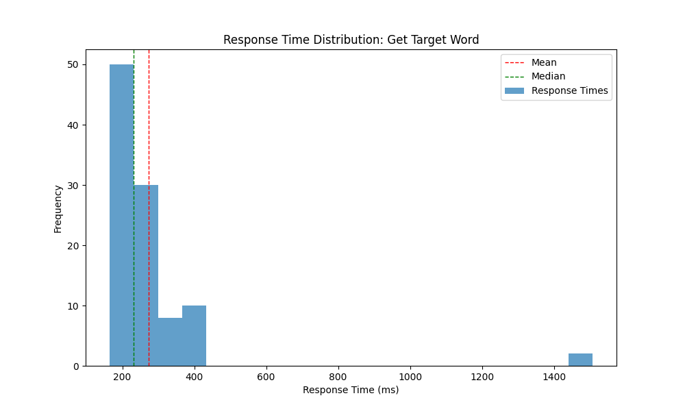
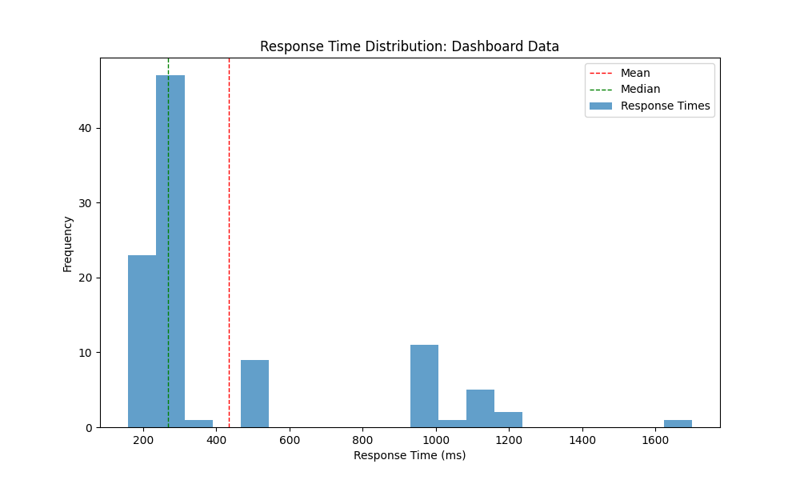
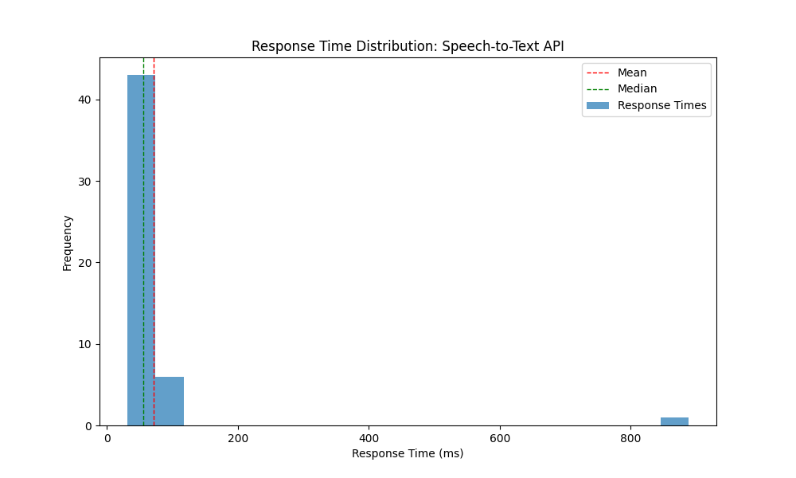

# Spello Backend Performance Test Report

Test executed on: 2025-03-23 06:33:09

## Summary

| API Endpoint | Success Rate | Avg Response (ms) | Median (ms) | 95th Percentile (ms) | Max (ms) |
|-------------|--------------|-------------------|-------------|----------------------|---------|
| Login API | 100.00% | 955.61 | 726.59 | 1934.98 | 2534.02 |
| Get User Profile | 100.00% | 395.70 | 354.72 | 652.12 | 1316.85 |
| Get Target Word | 100.00% | 534.04 | 455.52 | 820.13 | 2201.77 |
| Dashboard Data | 100.00% | 433.84 | 266.99 | 1138.19 | 1700.03 |
| Speech-to-Text API | 100.00% | 180.30 | 49.50 | 149.09 | 5890.57 |

## Detailed Results

### Login API

- **Total Requests**: 100
- **Success Rate**: 100.00%
- **Min Response Time**: 327.00 ms
- **Max Response Time**: 2534.02 ms
- **Average Response Time**: 955.61 ms
- **Median Response Time**: 726.59 ms
- **90th Percentile**: 1800.35 ms
- **95th Percentile**: 1934.98 ms
- **99th Percentile**: 2413.48 ms

### Get User Profile

- **Total Requests**: 100
- **Success Rate**: 100.00%
- **Min Response Time**: 188.55 ms
- **Max Response Time**: 1316.85 ms
- **Average Response Time**: 395.70 ms
- **Median Response Time**: 354.72 ms
- **90th Percentile**: 557.12 ms
- **95th Percentile**: 652.12 ms
- **99th Percentile**: 1313.85 ms

### Get Target Word

- **Total Requests**: 100
- **Success Rate**: 100.00%
- **Min Response Time**: 213.50 ms
- **Max Response Time**: 2201.77 ms
- **Average Response Time**: 534.04 ms
- **Median Response Time**: 455.52 ms
- **90th Percentile**: 700.18 ms
- **95th Percentile**: 820.13 ms
- **99th Percentile**: 2182.35 ms

### Dashboard Data

- **Total Requests**: 100
- **Success Rate**: 100.00%
- **Min Response Time**: 158.91 ms
- **Max Response Time**: 1700.03 ms
- **Average Response Time**: 433.84 ms
- **Median Response Time**: 266.99 ms
- **90th Percentile**: 998.88 ms
- **95th Percentile**: 1138.19 ms
- **99th Percentile**: 1202.95 ms

### Speech-to-Text API

- **Total Requests**: 50
- **Success Rate**: 100.00%
- **Min Response Time**: 37.01 ms
- **Max Response Time**: 5890.57 ms
- **Average Response Time**: 180.30 ms
- **Median Response Time**: 49.50 ms
- **90th Percentile**: 94.05 ms
- **95th Percentile**: 149.09 ms
- **99th Percentile**: 419.11 ms

## Recommendations

The following endpoints have slow response times (95th percentile > 1000ms):

- **Login API**: 1934.98 ms
- **Dashboard Data**: 1138.19 ms

Possible improvement areas:

1. Implement caching for frequently accessed data
2. Optimize database queries
3. Consider implementing connection pooling
4. Review any heavy processing in these endpoints
